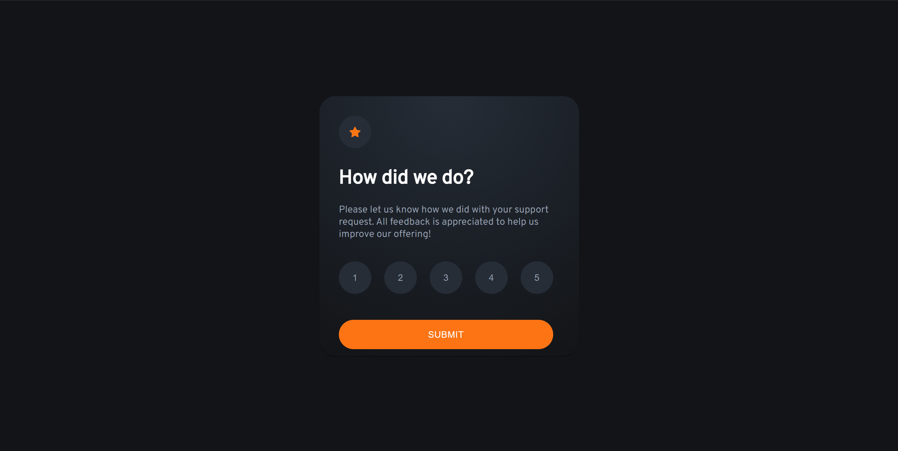
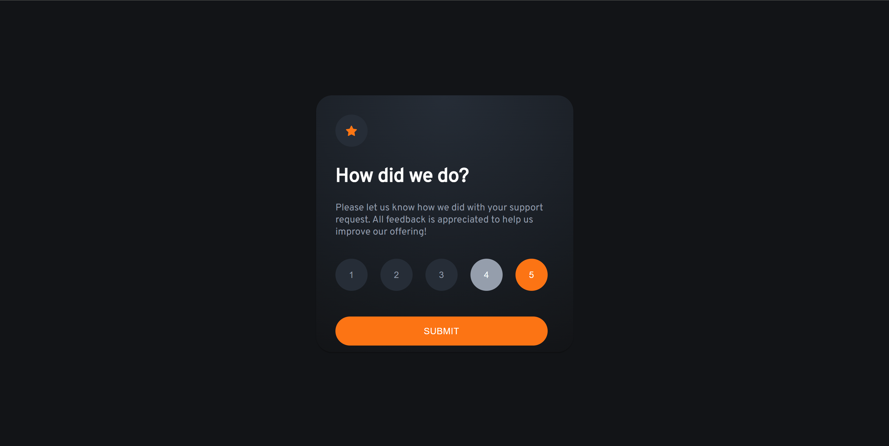
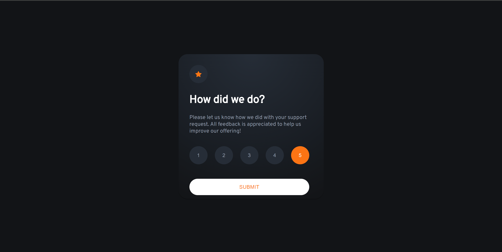
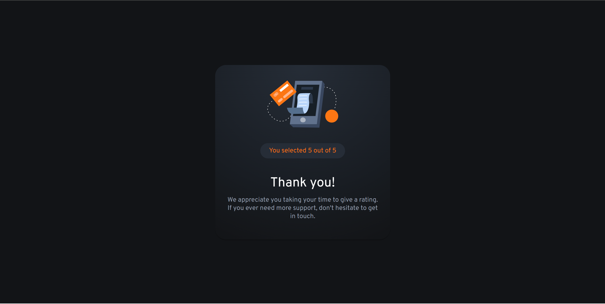

# Frontend Mentor - Interactive rating component solution

This is a solution to
the [Interactive rating component challenge on Frontend Mentor](https://www.frontendmentor.io/challenges/interactive-rating-component-koxpeBUmI).
Frontend Mentor challenges help you improve your coding skills by building realistic projects.

## Table of contents

- [The challenge](#the-challenge)
    - [Screenshot](#screenshot)
    - [Links](#links)
    - [Built with](#built-with)
    - [What I learned](#what-i-learned)
    - [Continued development](#continued-development)
    - [Useful resources](#useful-resources)
- [Author](#author)

### The challenge

Users should be able to:

- View the optimal layout for the app depending on their device's screen size
- See hover states for all interactive elements on the page
- Select and submit a number rating
- See the "Thank you" card state after submitting a rating

### Screenshot

### Links

- Solution URL: [GitHub Repositorie](https://github.com/apodgornyitba/Rating)
- Live Site URL: [Live Site URL](https://apodgornyitba.github.io/Rating/)

### Built with

- [React](https://reactjs.org/) - JS library
- [Next.js](https://nextjs.org/) - React framework
- [Node.js](https://nodejs.org/en) - Runtime Engine

## Author

- Website - [Andres Podgorny](https://github.com/apodgornyitba)
- Frontend Mentor - [@apodgornyitba](https://www.frontendmentor.io/profile/apodgornyitba)
- Twitter - [@PodgornyAndres](https://twitter.com/PodgornyAndres)